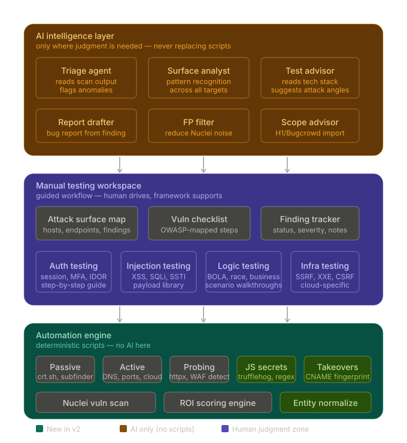

<div align="center">
  
</div>

<h1 align="center">RekonStrike v2</h1>

<p align="center">
  <em>Advanced Reconnaissance & Asset Discovery Framework organized into a Three-Plane Architecture</em>
</p>

<p align="center">
  <a href="#three-plane-architecture">Architecture</a> •
  <a href="#features">Features</a> •
  <a href="#quick-start">Quick Start</a> •
  <a href="#workflows">Workflows</a> •
  <a href="#api-modularization">API</a> •
  <a href="#docker">Docker</a>
</p>

---

RekonStrike v2 is a **professional-grade reconnaissance framework** that moves beyond simple automation. It organizes the offensive security workflow into three distinct planes: **Automation**, **Manual Workspace**, and **AI Intelligence**. Built with a decoupled, repository-based architecture for maximum flexibility and performance.

---

## 🏛 Three-Plane Architecture

RekonStrike is structured to separate deterministic automation from human judgment and intelligent analysis.

### 1. ⚡ Automation Engine (Bottom Plane)
*High-performance, deterministic reconnaissance scripts.*
- **Phases**: OSINT, DNS/Ports, HTTP Probing, Tech Detection.
- **Entity Normalization**: Strict hostname-centric deduplication.
- **ROI Scoring**: Intelligent asset prioritization based on 50+ signals.

### 2. 🛠 Manual Testing Workspace (Middle Plane)
*Guided workflow where the framework supports human judgment.*
- **Interactive Map**: Unified view of all assets, endpoints, and findings.
- **Guided Modules**: Step-by-step checklists for Auth (BOLA), Injection, Logic, and Infra (SSRF).
- **Workbench**: Professional interface for deep manual verification.

### 3. 🤖 AI Intelligence Layer (Top Plane)
*LLM-driven analysis for triage and pattern recognition.*
- **Triage Agent**: Flags anomalies and reduces scan noise.
- **Surface Analyst**: Identifies patterns across broad attack surfaces.
- **Report Drafter**: Drafts professional bug reports from validated findings.

---

## 🚀 Quick Start

### 1. Installation
```bash
git clone https://github.com/your-org/rekonstrike.git
cd rekonstrike
python3 -m venv .venv && source .venv/bin/activate
pip install -e .
```

### 2. Initialize Tools
```bash
# Checks for required Go tools (Subfinder, Httpx, Nuclei, etc.)
rekonstrike install
```

### 3. Launch a Scan
```bash
# Start a wildcard scan
rekonstrike scan example.com -t wildcard
```

### 4. Start the Web UI & API
```bash
# The API server uses modular routers and dependency injection
uvicorn rekonstrike.api.server:app --host 0.0.0.0 --port 8000
```

---

## 🏗 Modular API Structure

The RekonStrike API is modularized for clarity and performance:

| Method | Path | Router | Description |
|--------|------|--------|-------------|
| GET | `/scan/phases` | Scans | List all registered phases |
| POST | `/scan` | Scans | Initiate a new background scan |
| POST | `/scan/{id}/cancel` | Scans | Cancel a running scan session |
| WS | `/scan/ws/{id}` | Scans | Real-time scan event stream |
| GET | `/targets` | Targets | List all monitored targets |
| GET | `/targets/{id}/subdomains` | Targets | Paginated subdomain results |
| GET | `/targets/{id}/live-hosts` | Targets | High-ROI live web servers |
| GET | `/targets/{id}/vulnerabilities` | Targets | Findings with severity sorting |

---

## 🛠 Advanced Features

- **Repository Pattern**: Clean separation between business logic and database persistence.
- **Service Layer**: Centralized orchestration for complex workflows.
- **Schema-Driven Context**: Type-safe data transport between recon phases.
- **PostgreSQL Support**: Production-ready storage for large-scale operations.
- **Real-Time WebSockets**: Live progress updates with phase-by-phase status.

---

## 🐳 Docker Production

Deploy the full stack with PostgreSQL, Redis, and isolated tool containers:

```bash
docker compose up -d
```

Access the professional workbench at `http://localhost:80`.

---

## 📄 License

RekonStrike is released under the **MIT License**. See [LICENSE](LICENSE) for details.

---

<div align="center">
  <sub>Built for the modern security researcher.</sub>
</div>
